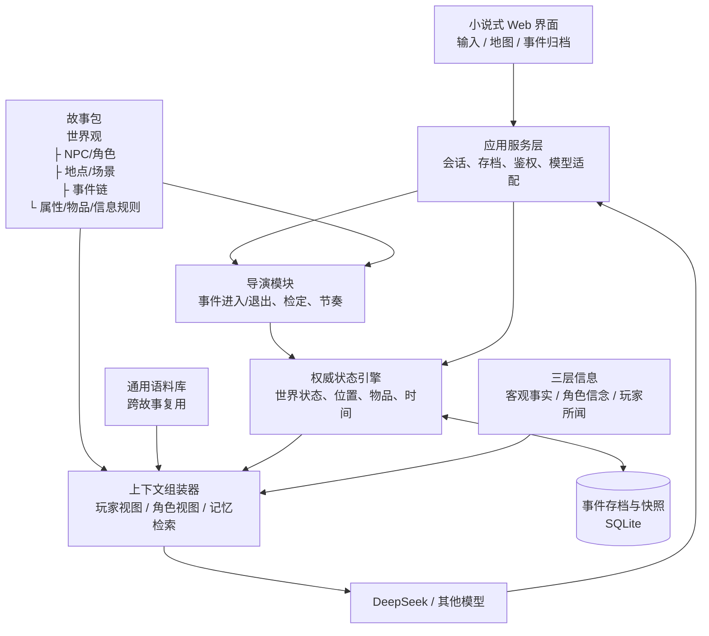

# 织梦·因果线与 SillyTavern 的架构对照

```mermaid
flowchart TB
  UI[小说式 Web 界面\n输入 / 地图 / 事件归档]
  API[应用服务层\n会话、存档、鉴权、模型适配]
  D[导演模块\n事件进入/退出、检定、节奏]
  E[权威状态引擎\n世界状态、位置、物品、时间]
  R[上下文组装器\n玩家视图 / 角色视图 / 记忆检索]
  L[故事包\n世界观\n  ├ NPC/角色\n  ├ 地点/场景\n  ├ 事件链\n  └ 属性/物品/信息规则]
  C[通用语料库\n跨故事复用]
  M[DeepSeek / 其他模型]
  S[(事件存档与快照\nSQLite)]
  B[三层信息\n客观事实 / 角色信念 / 玩家所闻]
  UI --> API
  API --> D
  D --> E
  E <--> S
  L --> D
  L --> R
  C --> R
  E --> R
  B --> R
  R --> M
  M --> API
  API --> E
```

SillyTavern 更接近：界面 → 提示词模板/扩展 → 模型；世界状态主要由提示词、聊天记录和扩展共同维护。织梦把状态引擎和导演模块放在模型之前，模型只能提出叙事与状态变更建议。
